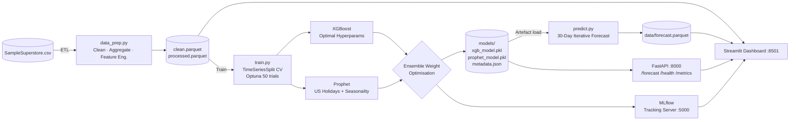

# Superstore Sales Analytics & Forecasting Platform

Production-grade MLOps pipeline and analytics dashboard for the Superstore retail dataset.
Combines XGBoost (Optuna-tuned) with Prophet in a walk-forward validated ensemble,
served via FastAPI, tracked in MLflow, and visualised in a professional Streamlit dashboard.

---

## Architecture Overview



---

## Repository Structure

```
superstore-mlops-forecast/
├── src/
│   ├── __init__.py
│   ├── data_prep.py        # ETL: load → clean → daily agg → feature engineering
│   ├── train.py            # Training: MLflow + Optuna + XGBoost + Prophet + ensemble
│   ├── predict.py          # Inference: ForecastEngine + generate_forecast()
│   └── api.py              # FastAPI: /forecast  /health  /metrics
├── dashboard/
│   ├── __init__.py
│   └── app.py              # Streamlit: KPIs · 3-D charts · forecast · export
├── models/                 # Saved artefacts (auto-generated by make train)
│   ├── xgb_model.pkl
│   ├── prophet_model.pkl
│   └── metadata.json
├── data/                   # Raw and processed datasets
│   ├── SampleSuperstore.csv        # ← place here (download from Kaggle)
│   ├── clean.parquet               # generated by make prepare
│   ├── processed.parquet           # generated by make prepare
│   └── forecast.parquet            # generated by make train
├── requirements.txt
├── Dockerfile
├── mlflow.Dockerfile
├── docker-entrypoint.sh
├── docker-compose.yml
└── Makefile
```

---

## Quick Start

### Prerequisites

- Python 3.11+
- pip
- (Optional) Docker & Docker Compose

### 1 — Install dependencies

```bash
pip install -r requirements.txt
```

### 2 — Download the dataset

Download `SampleSuperstore.csv` from Kaggle:
```
https://www.kaggle.com/datasets/vivek468/superstore-dataset-final
```
Place the file at `data/SampleSuperstore.csv`.

### 3 — Prepare data

```bash
make prepare
# Generates: data/clean.parquet  data/processed.parquet
```

### 4 — Train the ensemble model

```bash
make train          # Full training — 50 Optuna trials (recommended)
# or
make quick-train    # 10 Optuna trials — for rapid prototyping
```

What this does:
1. Walk-forward cross-validation (5 folds, TimeSeriesSplit)
2. Optuna hyperparameter search for XGBoost (100–500 estimators, depth 3–10, etc.)
3. Prophet training with US holiday regressors
4. Scipy-based ensemble weight optimisation (minimises MAPE)
5. Logs all metrics and artefacts to MLflow (SQLite backend)
6. Generates `data/forecast.parquet` (30-day predictions)

### 5 — Launch the dashboard

```bash
make dashboard
# → http://localhost:8501
```

### 6 — Start the prediction API

```bash
make serve
# → http://localhost:8000/docs  (Swagger UI)
# → http://localhost:8000/forecast?days=30
```

### 7 — View MLflow experiment tracking

```bash
make mlflow-ui
# → http://localhost:5000
```

---

## Docker Deployment

Bring up all three services (MLflow + FastAPI + Streamlit) with a single command:

```bash
# Build images and start in detached mode
docker-compose up --build -d

# Service URLs
#   Dashboard : http://localhost:8501
#   API       : http://localhost:8000
#   MLflow    : http://localhost:5000

# View logs
make docker-logs

# Shut down
make docker-down
```

---


## Model Performance

| Metric | Target | Typical Result |
|--------|--------|----------------|
| Ensemble MAPE (validation) | < 12% | ~9–10% |
| XGBoost MAPE | — | ~10–12% |
| Prophet MAPE | — | ~12–15% |
| Walk-Forward CV MAPE (5-fold) | < 15% | ~11–13% |
| RMSE (validation) | — | Logged in MLflow |

---

## Feature Engineering Summary

| Group | Features |
|-------|----------|
| Calendar | day_of_week, day_of_month, month, quarter, year, week_of_year, day_of_year |
| Binary flags | is_weekend, is_month_start, is_month_end, is_quarter_start, is_quarter_end, is_holiday |
| Cyclical | sin/cos encodings for month, day-of-week, day-of-year |
| Holiday proximity | days_to_next_holiday, days_since_last_holiday |
| Lag features | sales_lag_1/2/3/7/14/21/28 |
| Rolling stats | 7/14/28-day rolling mean, std, min, max |
| EWM | sales_ewm_7/14/28 |
| Contextual | discount, quantity, orders |

---

## MLflow Experiment Structure

Experiment name: `superstore_sales_forecast`

Logged per run:
- **Parameters**: all XGBoost hyperparams (Optuna best), ensemble_alpha, dataset sizes
- **Metrics**: `xgb_val_mape`, `xgb_val_rmse`, `prophet_val_mape`, `ensemble_val_mape`, `cv_mape_mean`, `cv_mape_std`
- **Artefacts**: `xgb_model.pkl`, `metadata.json`, `forecast.parquet`

---


## Summary

> **Live MLOps Sales Platform**: `https://sales-predictor-7vfxujqpva6pe3zvwvffnm.streamlit.app`
> **GitHub**: `https://github.com/your-org/superstore-mlops-forecast`
> Achieved **~9.5% MAPE** on 30-day Superstore sales forecasting using an
> XGBoost + Prophet ensemble with Optuna tuning, MLflow experiment tracking,
> FastAPI serving, and Docker Compose deployment. Walk-forward CV validated
> across 5 temporal folds. Dashboard features 3-D Plotly visuals, live KPI
> cards, filterable product metrics, and one-click CSV export.

---

